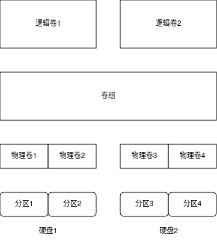

# 文件系统

## linux文件系统

### 基本的linux文件系统

#### ext文件系统

- 拓展文件系统，是类unix文件系统，使用虚拟目录来操作硬件设备，在物理设备上按定长的块来存储数据。
- 采用名为**索引节点**的系统来存放虚拟目录中所存储的信息。索引节点系统在每个物理设备商创建一个单独的表(索引节点表)来存储这些文件信息。
- 存储在虚拟目录中的每一个文件在索引节点表中都有一个条目。
  - ext文件系统中的拓展部分来自其跟踪的每个文件的额外数据
    - 文件名
    - 文件大小
    - 文件的属主
    - 文件的属组
    - 文件的访问权限
    - 指向存有文件数据的每个硬盘块的指针
- linux通过唯一的索引节点号(inode号)，来引用索引节点表中每个索引节点，这个值是创建文件时由文件系统分配的，文件系统通过索引节点号而不是文件全名及路径来标识文件。
- 文件大小不能超过2GB。
- 文件写入到物理设备时，存储数据用的块很容易分散在整个设备中(碎片化)，数据块的碎片化会降低文件系统的性能，因为需要更长时间在存储设备中查找特定文件的所有块。
- ext文件系统每次存储或更新文件，它都要用新信息来更新索引节点表，如果在更新的过程中出现故障如系统崩溃，断电等，即使文件数据正常保存到了物理设备上，如果索引节点表记录没完成更新，ext文件系统无法识别这个文件。

#### ext2文件系统

- ext2文件系统是ext文件系统的基本功能的拓展，保持了同样的结构。
- ext2文件系统拓展了索引节点表来保存更多信息，来帮助系统管理员追踪文件的访问情况。
  - 文件的创建时间值
  - 文件的修改时间值
  - 文件的最后访问时间值
- 允许的最大文件大小为2TB后期增加到32TB。
- ext2文件改变了文件在数据块中的存储方式。ext2在保存文件时，通过按组分配磁盘块来减轻碎片化。通过将数据块分组，文件系统在读取文件时不需要为了数据块查找整个物理设备。
- ext2同ext,如果在更新索引节点表时出现问题，就会出现故障。

### 日志文件系统

- 不再使用先将数据直接写入存储设备再更新索引节点表的方法，而是先将文件的更改写入到临时文件(日志)，在数据成功写到存储设备和索引节点表之后，再删除对应的日志条目。
- 如果系统在数据被写入存储设备之前崩溃或断电，日志文件系统下次会读取日志文件并处理上次留下的为写入的数据。
- 文件系统日志方法

|方法|描述|
|-|-|
|数据模式|索引节点和文件都会被写入日志，丢失数据风险低但性能差|
|有序模式|只有索引节点数据会被写入日志，但只有数据成功写入后才会删除|
|回写模式|只有索引节点数据会被写入日志，但不控制文件数据何时写入，丢失数据风险高|

- 数据模式日志方法是最安全的数据保护方法，也是最慢的。所有写到存储设备上的数据都必须写两次，第一次写入日志，第二次写入存储设备，会导致性能差。

#### ext3文件系统

- 采用和ext2文件系统相同的索引节点表结构，但是给每个存储设备添加了一个日志文件，以将准备写入存储设备的数据先记录日志。拥有了基本的日志功能。
- 默认情况，ext3使用有序模式的日志功能，只将索引节点信息写入日志文件，直到数据块都被成功写入存储设备才删除。可以在创建文件系统时将日志方法改为数据模式或回写模式。
- 无法恢复误删的文件，没有任何内建的数据压缩功能，ext3不支持加密文件。

#### ext4文件系统

- 在ext3上进行拓展，支持数据压缩和加密，还支持**区段**。
  - 区段在存储设备上按块分配空间，但在索引节点表中只保存起始块的位置。无需列出所有用来存储文件中数据的数据块，可以在索引节点表中节省一些空间。
  - 引入了**块预分配技术**，可以给要变大的文件预留空间，ext4文件系统可以为文件系统分配所有需要用到的块，不仅仅是现在用到的，会用0填满预留的数据块，不会将其分配给其他文件。

#### Reiser文件系统

- 只支持回写日志模式，最快的日志文件系统。
- 可以在线调整已有文件系统的大小。
- **尾部压缩技术**，能将一个文件的数据填进另一个文件的数据块中的空白空间。为已有文件系统扩容来容纳更多的数据。可以扩大或缩小。

#### JFS文件系统

- 日志化文件系统，采用的是有序模式日志方法。
- 采用基于区段的文件分配，为每个写入存储设备的文件分配一组块，可以减少存储设备商的碎片。

#### XFS文件系统

- 采用回写模式日志方法，高性能，但有一定丢失风险。
- 允许在线调整文件系统的大小，只能扩大不能缩小。

### 写时复制文件系统

- **写时复制技术(COW)**,利用快照兼顾安全性和性能。
- 如果要修改数据，会使用克隆或可写快照。修改过的数据并不会直接覆盖当前数据，而是被放入文件系统中的另一个位置上，即便数据修改已经完成，之前的就数据也不会被重写。

#### ZFS文件系统

- 稳定

#### Btrfs文件系统

- B数文件系统
- 稳定性，易用性，能够动态调整已挂载文件系统的大小。

## 操作文件系统

### 创建分区

- 在硬盘创建分区容纳文件系统，分区可以是整个硬盘也可以是部分硬盘，容纳虚拟目录的一部分。
- fdisk指定分区的存储设备设备名后可管理安装在系统上的存储设备的分区。
- 第一次给存储设备分区时会提示没有分区表。
- 分区可以按主分区或扩展分区创建。
  - 主分区可以被文件系统直接格式化
  - 扩展分区只能容纳其他逻辑分区。扩展分区出现的原因是每个存储设备只能有4个分区，可以创建扩展分区，然后在扩展分区内创建逻辑分区进行扩展。
- fdisk的p命令打印出的信息中的ID列，定义了linux如何对待该分区，默认类型是83，该类型定义了一个linux文件系统。
- 存储设备的分区信息写入到分区表后，可以通过ioctl()调用来获取新分区的出现，可以使用linux文件系统对其进行格式化。
  - 如果生产新分区表后没有提醒，可以使用partprob,hdparm.

#### fdisk的命令及描述

|命令|描述|
|-|-|
|a|设置活动分区标志|
|b|编辑BSD unix系统用的磁盘标签|
|c|设置DOS兼容标志|
|d|删除分区|
|g|创建一个新的空的 GPT（GUID 分区表）|
|l|显示可用的分区类型|
|m|显示命令选项|
|n|添加一个新分区|
|o|创建DOS分区表|
|p|显示当前分区表|
|q|退出，不保存更改|
|s|为Sun Unix系统创建一个新磁盘标签|
|t|修改分区的系统ID|
|u|改变使用的存储单位|
|v|验证分区表|
|w|将分区写入磁盘|
|x|高级功能|

### 创建文件系统

- 数据存储到分区之间，必须用文件系统对其进行格式化。创建日志类文件
- 创建文件系统后，需要将其挂载到虚拟目录下的某个挂载点，然后可以将数据存储在新文件系统中，可以将新文件系统挂载到虚拟目录中虚拟额外空间的任何位置。
  - 使用mount可暂时挂载，将其写入/etc/fstab中可长期生效。

|工具|用途|
|-|-|
|mkefs|创建ext文件系统|
|mke2fs|创建ext2文件系统|
|mkfs.ext3|创建ext3文件系统|
|mkfs.ext4|创建ext4文件系统|
|mkreiserfs|创建ReiserFS文件系统|
|jfs_mkfs|创建JFS文件系统|
|mkfs.xfs|创建XFS文件系统|
|mkfs.zfs|创建ZFS文件系统|
|mkfs.btrfs|创建Brtfs文件系统|

### 文件系统的检查与修复

- fsck命令能够检查和修复大部分类型的linux文件系统。
  - 可以列出多个需要检查的文件系统，文件系统可以通过设备名，在虚拟目录中的挂载点以及分配给文件系统的唯一UUID值来引用
  - 使用/etc/fstab文件自动决定正常挂载到系统的存储设备的文件系统。如果存储设备尚未挂载，需要使用-t参数指定文件系统的类型。
  - 只能在未挂载的文件系统上运行fsck,大多数文件系统只需要卸载文件系统来进行检查，检查完成后重新挂载。但根文件系统含有所有核心的linux命令和日志文件，因此无法处在运行状态的系统上卸载它。
  - fsck的参数和描述

|参数|描述|
|-|-|
|-a|如果检测到错误，自动修复文件系统|
|-A|检查/etc/fstab文件中列出的所有文件系统|
|-C|给支持进度条功能的文件系统显示一个进度条(ext2和ext3)|
|-N|不进行检查，只显示哪些检查会执行|
|-r|出现错误时提示|
|-R|使用-A选项时跳过根文件系统|
|-s|检查多个文件系统时，依次进行检查|
|-t|指定要检查的文件系统类型|
|-T|启动时不显示头部信息|
|-V|在检查时产生详细输出|
|-y|检测到错误时自动修复文件系统|

## 逻辑卷管理

- 使用标准分区在硬盘创建了文件系统，为已有文件系统添加额外的空间，只能在同一块物理硬盘的可用空间范围内调整分区大小。如果硬盘上没有空间就必须换硬盘，然后迁移数据。
- linux逻辑卷管理器(LVM)可以通过将另外一个硬盘上的分区加入已有文件系统，动态地添加存储空间。可以在无需重建整个文件系统的情况下，管理磁盘空间。

### 逻辑卷管理布局

- 在逻辑卷管理中，硬盘分区称作**物理卷(PV)**，每个物理卷都会映射到硬盘上特定的物理分区。
- 多个物理卷集中在一起可以形成一个**卷组(VG)**。逻辑卷管理系统将卷组视为一个物理硬盘，但事实上卷组可能是由分布在多个物理硬盘上的多个物理分区组成的。卷组提供了一个创建逻辑分区的平台，逻辑分区则包含了文件系统。
- 整个结构中的最后一层是**逻辑卷(LV)**,逻辑卷为linux提供了创建文件系统的分区环境，作用类似于linux中的物理硬盘分区。linux系统将逻辑卷视为物理分区。
- 可以使用任意一种标准linux文件系统来格式化逻辑卷，再将其加入到linux虚拟目录中的某个挂载点。
- 如果硬盘有未使用分区，通过逻辑分区管理，可以将这个未使用分区分配到已有卷组，创建新逻辑卷或拓展已有逻辑卷。

### linux中的LVM

- LVM有两个版本LVM1和LVM2
- LVM允许在逻辑卷在线的状态下将其复制到另一个设备，该功能叫做**快照**。
  - 快照可用于备份高可靠性需求而无法锁定的重要数据。
  - 传统的备份方式将文件复制到备份媒体上时通常需要将文件锁定。
  - LVM1只允许创建只读快照，创建后就无法向其中写入数据。LVM2允许创建在线逻辑卷的可读写快照，可以删除原先的逻辑卷，然后将快照作为替代挂载。
- LVM提供**条带化**，可以跨多个物理硬盘创建逻辑卷，当linux LVM将文件写入逻辑卷时，文件的数据块会被分散到多个硬盘上。每个后继数据块会被写到下一个硬盘。
  - 条带化可以提高硬盘性能，可以将一个文件的多个数据块同时写入到多个硬盘而无需等待单个硬盘移动读写磁头到多个不同位置。
  - LVM条带化不同于RAID条带化，LVM条带化不提供用来创建容错环境的校验信息。
  - 会增加文件因硬盘故障而丢失的概率，单个硬盘故障可能会造成多个逻辑卷无法访问。
- **镜像**是一个实时更新的逻辑卷的完整副本，当创建镜像逻辑卷时，LVM会将原始逻辑卷同步到镜像副本中。根据逻辑卷大小，需要一定时间。
  - 一旦原始同步完成，LVM会为文件系统的每次写操作执行两次写入，一次写入到主逻辑卷，一次写入到镜像副本，会降低系统的写入性能。

### 使用linux LVM

#### 定义LVM物理卷

- 将硬盘上的物理分区转换成LVM使用的物理卷区段。
- fdisk的分区类型为8e时表示这个分区会被用作LINUX LVM系统的一部分，而不是一个直接的文件系统。
- 创建实际的物理卷，pvcreate命令定义用于物理卷的物理分区。
  - pvcreate会检查分区是否为多路。
- pvdisplay可以显示已创建的物理卷列表。
  - 物理卷不属于某个卷组。

#### 创建LVM卷组

- 使用vgcreate命令，从物理卷创建一个或多个卷组。
  - vgcreate 卷组名 物理卷名/分区名
- 使用vgdisplay查看创建的卷组的细节

#### 创建LVM逻辑卷

- 可以定义逻辑卷的文件系统，然后将其挂载。
- lvcreate创建逻辑卷

|选项|描述|
|-|-|
|-c|指定快照逻辑卷的单位大小|
|-C|设置或重置连续分配策略|
|-i|指定条带数|
|-I|指定每个条带的大小|
|-l|指定分配给新逻辑卷的逻辑区段数，或者要用的逻辑区段的百分比|
|-L|指定分配给新逻辑卷的硬盘大小|
|-m|创建逻辑卷镜像|
|-M|让次设备号一直生效|
|-n|指定新逻辑卷的名称|
|-p|为逻辑卷设置r/w权限|
|-r|设置预读扇区数|
|-R|指定将镜像分成多大的区|
|-s|创建快照逻辑卷|
|-Z|将新逻辑卷的前1KB数据设置为0|

#### 创建LVM文件系统

- 与正常分区一样创建文件系统，挂载
- LVM设备在/dev/Vol1目录下

#### 修改LVM

- 逻辑卷中的文件系统需要手动修整来处理大小上的改变，大多数文件系统都包含了能够重新格式化文件系统的命令行程序，比如ext2,ext3和ext4的resize2fs命令。
- LVM命令

|命令|功能|
|-|-|
|vgchange|激活和禁用卷组|
|vgremove|删除卷组|
|vgextend|将物理卷加到卷组中|
|vgreduce|从卷组中删除物理卷|
|lvextend|增加逻辑卷的大小|
|lvreduce|减小逻辑卷的大小|
