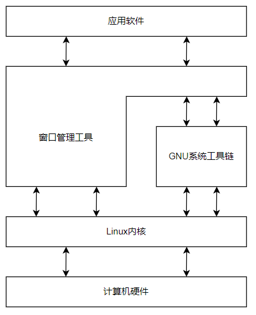

- [linux shell](#linux-shell)
  - [Linux 系统组成](#linux-系统组成)
  - [Linux内核](#linux内核)
    - [系统内存管理](#系统内存管理)
    - [软件程序管理](#软件程序管理)
    - [硬件设备管理](#硬件设备管理)
    - [文件系统管理](#文件系统管理)
  - [GNU工具](#gnu工具)
    - [shell](#shell)
    - [桌面环境](#桌面环境)
      - [X Window](#x-window)
      - [其他桌面环境](#其他桌面环境)
  - [文本命令行](#文本命令行)

# linux shell

## Linux 系统组成

- linux的组成部分
  - linux内核
  - GNU工具
  - 图形化桌面环境
  - 应用软件

## Linux内核

- Linux内核控制计算机系统上的所有硬件和软件，在必要时分配硬件并根据需要执行软件。
- 内核主要的功能
  - 系统内存管理
  - 软件程序管理
  - 硬件设备管理
  - 文件系统管理

### 系统内存管理

- 内核不仅管理服务器上的可用物理内存，还可以创建和管理虚拟内存。
- 内核通过硬盘上的存储空间来实现虚拟内存，这块区域称为交换空间。内核不断在swap和物理内存之间反复交换虚拟内存中的内容来实现。

### 软件程序管理

- 内核创建了第一个进程(init进程)来启动系统上所有其他进程。当内核启动时，他会将init进程加载到虚拟内存中。
- 内核在启动任何其他进程时，都会在**虚拟内存**中给新进程分配一块专有区域来存储该进程用到的数据和代码。
- linux管理开机自启动
  - 使用一个表来管理需要自启动的进程。在/etc/inittab中。
  - 将开机时启动或停止某个应用的脚本放在/etc/init.d目录下。该脚本会通过/etc/rcX.d目录下的入口启动(X表示运行级)。
- init系统采用运行级。运行级决定了init进程运行/etc/inittab文件或/etc/rcX.d目录中定义好的某些特定类型的进程。
- 一共有5个启动运行级。运行级为1时为**单用户模式**，只启动基本的系统进程以及一个控制台终端进程，只有一个用户能登录到系统上操作数据。标准的启动运行级是3，会启动大多数软件如网络等。运行级为5时，会启动图形化的X Window系统并允许用户通过图形化桌面窗口登陆系统。
- 可以通过调整启动运行级来控制整个系统的功能。

### 硬件设备管理

- 任何linux系统需要与之通信的设备都需要在内核代码中加入其驱动程序代码。
- 驱动程序代码允许内核与设备之间交换数据。
- 插入设备驱动代码的两种方法
  - 编译进内核的设备驱动代码
    - 插入后需要重新编译内核
  - 可插入内核的设备驱动模块
- Linux将硬件设备当成特殊文件，称为设备文件。
  - 字符型设备文件
    - 处理数据时只能处理一个字符的设备。
  - 块设备文件
    - 处理数据时每次能处理大块数据的设备。
  - 网络设备文件
    - 采用数据包发送和接收数据的设备。包括网卡和一个特殊的回环设备。该设备使得Linux可以使用常见的网络编程协议同自身通信。
    - Linux为系统上的每个设备都创建一种称为**节点**的特殊文件。与设备的所有通信都通过设备节点完成。每个节点都有唯一的**数值对**供Linux内核标识它。数值对包括一个主设备号和一个次设备号。类似的设备被划分到同样的主设备号下。**次设备号用于标识主设备组下的某个特定设备**。

### 文件系统管理

- linux将文件存储在单个目录结构中，该目录称为虚拟目录。虚拟目录将安装在PC上的所有存储设备的文件路径纳入单个目录结构中。
- 磁盘挂载要先挂载根目录
- 挂载的第一块硬盘称为根驱动器，跟驱动器包含了虚拟目录的核心，其他目录都是从那里开始构建的。
- linux会在跟驱动器上创建一些特别的目录，称为挂载点。挂载点是虚拟目录中用于分配额外存储设备的目录。虚拟目录会让文件和目录出现在这些挂载点目录中，但是他们存储在另外的驱动器中。
- Linux内核支持通过不同类型的文件系统从硬盘中读写数据。
- 内核必须在编译时就加入对所有可能用到的文件系统的支持。
- Linux内核采用虚拟文件系统(VFS)作为和每个文件系统交互的接口。当每个文件系统都被挂载和使用时，VFS将信息都缓存在内存中。

|文件系统|描述|
|-|-|
|ext|Linux拓展文件系统|
|ext2|提供更多功能|
|ext3|支持日志功能|
|ext4|支持高级日志|
|hpfs|OS/2高性能文件系统|
|jfs|IBM日志文件系统|
|iso9660|CD-ROM|
|minix||
|msdos|FAT16|
|ncp|Netware文件系统|
|nfs|网络文件系统|
|ntfs|支持Microsoft NT文件系统|
|proc|访问系统信息|
|ReiserFS|高级Linux文件系统，能提供能提供更好的性能和硬盘回复功能|
|smb|支持网络访问的Samba SMB文件系统|
|sysv|早期Unix文件系统|
|ufs|BSD文件系统|
|umsdos|建立在msdos上的类Unix文件系统|
|vfat|Windows95文件系统(FAT32)|
|XFS|高性能64位日志文件系统|

## GNU工具

- 核心GNU工具
  - 处理文件
  - 操作文本
  - 管理进程

### shell

- shell的核心是命令行提示符。命令行提示符是shell负责交互的部分，允许输入文本命令，然后解释命令并在内核执行。
- 登陆时系统启动的shell依赖于用户账户的配置。
  - /etc/passwd文件包含了所有系统用户账户列表以及每个用户的基本配置信息。
  - 每个条目分为七个字段，字段之间用冒号分隔。最后一个字段指定了用户使用的shell程序。
  - 提示符为[用户名@系统名]，$为普通用户，#为root用户
- 常见的shell

|shell|描述|
|-|-|
|bash||
|ash|运行在内存受限环境中简单地轻量级shell，与bash完全兼容|
|korn|与Bourne shell兼容的编程shell，支持关联数组和浮点运算等一些高级的编程特性|
|tesh|将C语言中的一些元素引入到shell|
|zsh|结合了bash，tesh和korn的特性，同时提供高级编程特性，共享历史文件和主体化提示符的高级shell。|

### 桌面环境

#### X Window

- x window软件直接和PC上的显卡及显示器打交道的底层软件。
- 核心的x window软件只能产生图像不能交互。
- 图形化桌面环境要占用相当一部分系统资源来保证正常运行。

#### 其他桌面环境

|桌面环境|特征|
|-|-|
|KDE|界面类似windows，自定义选项多，配置要求高|
|GNOME|界面简洁，自定义选项少，相对轻量级可以在较低配置下工作|
|Unity|为各种移动设备提供一致的桌面体验|
|Fluxbox|没有面板的轻型桌面，仅有一个可用来启动程序的弹出式菜单。|
|Xfce|和KDE很像，少很多图像以适应低内存环境。|
|JWM|joe的窗口管理器，适用于低内存低硬盘空间的超轻型桌面|
|Fvwm|支持虚拟桌面和面板等高级桌面功能，但能在低内存环境中运行。|
|fvwm95|fwvm衍生的，风格与win95桌面相似|

## 文本命令行

- 通过Alt+Ctl+(F1~F7切换虚拟控制台)
- 可以打开一个新的标签启动一个新的CLI会话，每个标签中的会话被视为独立的CLI会话

|选项|参数|描述|
|-|-|-|
|-background|black,white,red,green,yellow,blue,magenta,cyan|修改终端背景色|
|-foreground|black,white,red,green,yellow,blue,magenta,cyan|修改终端前景色|
|-inversescreen|on,off|交换背景色和前景色|
|-reset|无|将终端外观恢复默认并清屏|
|-store|无|将当前设置保存为-reset的默认值|
